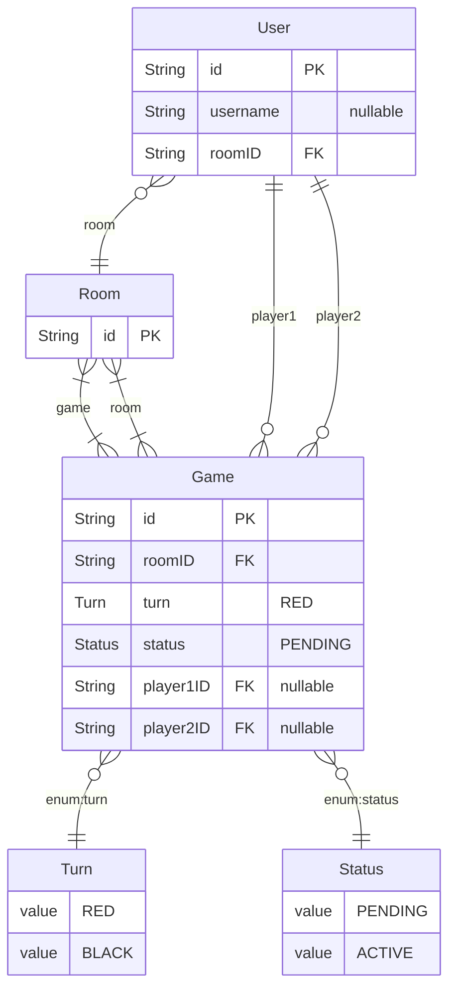

```mermaid
erDiagram
	Status {
		value PENDING
		value ACTIVE
	}
	Turn {
		value RED
		value BLACK
	}
	User {
		String id PK
		String username  "nullable"
		String roomID FK
	}
	Room {
		String id PK
	}
	Game {
		String id PK
		String roomID FK
		Turn turn "RED"
		Status status "PENDING"
		String player1ID FK  "nullable"
		String player2ID FK  "nullable"
	}
	User }o--|| Room : room
	Room }|--|{ Game : game
	Game }|--|{ Room : room
	Game }o--|| User : player1
	Game }o--|| User : player2
	Game }o--|| Turn : "enum:turn"
	Game }o--|| Status : "enum:status"

```
